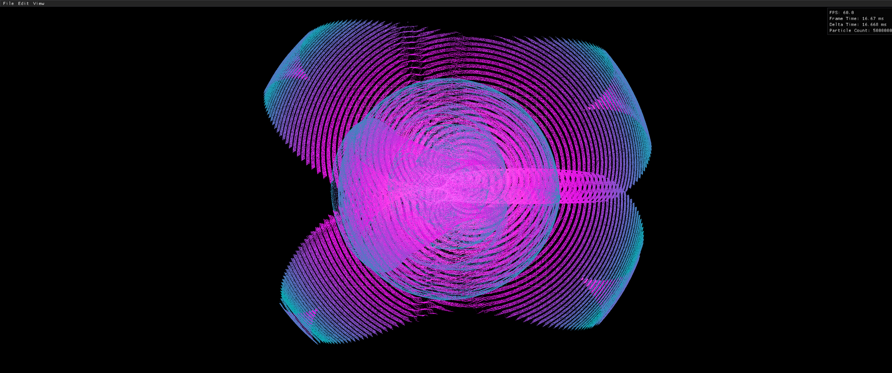

# OpenGL Particle Simulation

A high-performance particle simulation system leveraging modern OpenGL features and GPU acceleration. This project demonstrates advanced graphics programming techniques, SIMD optimizations, and efficient GPU memory management.

## Features

### Core Systems
- **GPU-Accelerated Particle Physics**
  - Real-time particle position and velocity updates
  - Compute shader-based physics calculations
  - SIMD-optimized particle initialization
  - Delta time-based simulation stepping

- **Modern OpenGL Pipeline**
  - Shader Storage Buffer Objects (SSBOs) for efficient data transfer
  - Instanced rendering for optimal performance
  - Compute/Vertex/Fragment shader pipeline
  - Custom shader program management system

### Optimizations
- **GPU Memory Management**
  - Color gradient LUT using SSBO
  - Efficient buffer management system
  - Zero-copy GPU memory updates
  - Optimized uniform handling with caching

- **SIMD Optimizations**
  - SSE/SSE2 particle initialization
  - Vectorized random number generation
  - Optimized memory alignment
  - SIMD-accelerated velocity calculations

### Visualization & Interaction
- **Dynamic Grid System**
  - Configurable reference grid
  - Scale and spacing controls
  
- **Interactive Controls**
  - Mouse-based gravity point control
  - Camera pan and zoom functionality
  - Real-time simulation speed control (0.1x to 20x)
  - Smooth time scale interpolation

- **Performance Monitoring**
  - Real-time FPS counter
  - Frame time tracking
  - Particle count display
  - Delta time monitoring

### Technical Details
- **Memory Efficiency**
  - Shader uniform caching system
  - Optimized buffer creation and management
  - Smart resource cleanup
  - Forward-declared OpenGL types

### Dependencies
- **GLFW** - Window management and OpenGL context
- **CGLM** - Graphics mathematics library
- **GLAD** - OpenGL function loader
- **Dear ImGui** - Debug UI and controls
