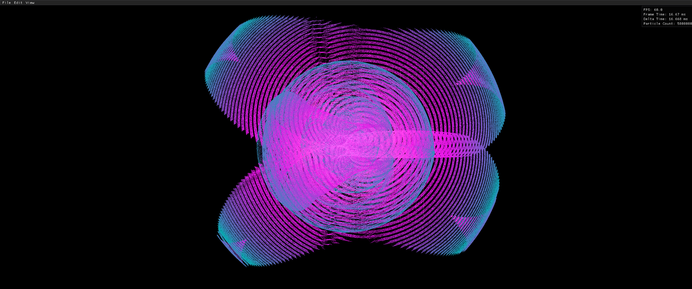

# OpenGL Particle Simulation

A high-performance particle simulation system leveraging modern OpenGL features and GPU acceleration. This project demonstrates graphics programming techniques and parallel computing concepts through an interactive 2D particle system.

## Features

### Core Systems
- **GPU-Accelerated Particle Physics**
  - Real-time particle position and velocity updates
  - Gravity point influence system
  - Delta time-based simulation stepping

- **Modern OpenGL Pipeline**
  - Vertex/Fragment shaders for rendering
  - VAO/VBO management for efficient rendering
  - Custom shader compilation and management system

### Visualization & Interaction
- **Dynamic Grid System**
  - Configurable reference grid
  - Scale and spacing controls
  
- **Interactive Controls**
  - Mouse-based gravity point control
  - Camera zoom functionality
  - Real-time simulation parameter adjustment

- **Performance Monitoring**
  - Real-time FPS counter
  - Frame time tracking
  - Particle count display
  - Delta time monitoring

### Dependencies
- **GLFW** - Window management and OpenGL context
- **CGLM** - Graphics mathematics library
- **GLAD** - OpenGL function loader
- **Dear ImGui** - Debug UI and statistics display

## Built-In Recording (FFmpeg + VAAPI)

The engine can capture frames directly from its OpenGL back buffer and encode with VAAPI.

1. Configure with recording enabled:
```bash
cmake -S . -B build -DENABLE_RECORDING=ON
cmake --build build
```
2. Run with recording enabled:
```bash
ENGINE_RECORD=1 ./main
```

Optional environment variables:
- `ENGINE_RECORD_OUTPUT` (default: `capture.mkv`)
- `ENGINE_RECORD_CODEC` (default: `hevc_vaapi`)
- `ENGINE_RECORD_DEVICE` (default: `/dev/dri/renderD128`)
- `ENGINE_RECORD_RATE_CONTROL` (default: `quality`, options: `quality`, `cbr`)
- `ENGINE_RECORD_QP` (default: `18`, used in `quality` mode; lower = higher quality)
- `ENGINE_RECORD_BITRATE_KBPS` (default: `50000`)
- `ENGINE_RECORD_FPS` (default: `60`)
- `ENGINE_RECORD_KEYINT` (default: `FPS * 2`)
